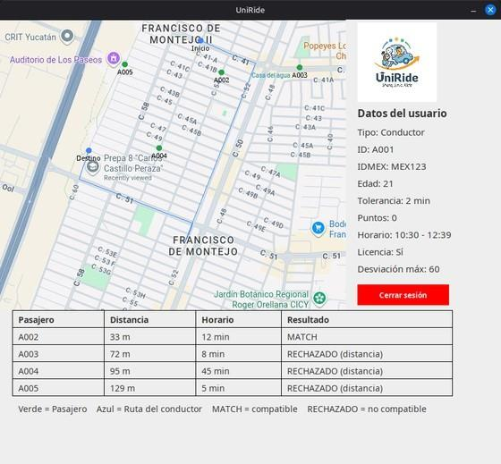

# UniRide

**University carpooling platform that matches drivers and passengers by route and schedule.**

Students register where they leave from, which campus they are heading to, their class schedule and how many minutes they are willing to wait. UniRide models the city as a weighted graph, computes the driver's shortest route with **Dijkstra's algorithm**, and then evaluates every passenger against that route to decide who can share the trip.

Built in **Java 21 + Swing**, with no external dependencies.



*Driver view: shortest route in blue, passengers in green, and the matchmaking table with the outcome for each passenger.*

---

## How it works

**1. The map becomes a graph.** 187 nodes are read from coordinate files and wired into a weighted, bidirectional adjacency structure. Four single-purpose loaders build it: `ReadNodes` creates the vertices, `AddAllAdjacents` links the main streets, `ReadAddColumns` adds the cross-street edges, and `ReadRemoveAdjacents` deletes the connections that do not exist on the real map.

**2. Dijkstra finds the driver's route.** `Dijkstra.shortestPath()` runs from the driver's origin and leaves every node holding both its distance and the shortest path used to reach it. The path to the driver's destination is the route everything else is measured against.

**3. Passengers are matched against that route.** `MatchMaker` applies two filters and returns a `MatchResult` for each passenger:

| Result | Meaning |
| --- | --- |
| `MATCH` | Schedule and distance are both compatible |
| `REJECTED_SCHEDULE` | Arrival times differ by more than the passenger's tolerance |
| `REJECTED_DISTANCE` | Passenger is farther from the route than the driver's maximum detour |

The schedule filter is what makes the system usable in practice: a driver passing by at 6:30 AM and a passenger who prefers 6:45 AM still match if the passenger's tolerance is 20 minutes.

---

## Data structures & algorithms

This is the part of the project where most of the work went.

- **Weighted graph** — each `Node` owns a `Map<Node, Integer>` of its neighbours, so adjacency and edge weight are stored together. Edges are inserted bidirectionally through an overloaded `addDestination`, with street edges weighted 2 and cross-street edges weighted 1.
- **Dijkstra's shortest path** — implemented from scratch with settled/unsettled `HashSet`s and a linear scan for the minimum-distance node (O(V²), which is a reasonable trade-off at this graph size). Each node accumulates its own path in a `LinkedList`, so the full route is available without a separate backtracking pass.
- **Distance to a route** — a passenger's cost is the minimum Euclidean distance between their origin and any node on the driver's path, compared against the driver's maximum allowed deviation.
- **Time arithmetic** — `Schedule` uses `java.time.LocalTime` and `ChronoUnit.MINUTES` instead of hand-rolled integer math, which keeps the tolerance comparison a single readable expression.

## Object-oriented design

- **Inheritance and abstraction** — `User` is abstract and declares `isUserVerified()` and `whichUser()`; `Driver` and `Passenger` each implement them their own way. Only a `Driver` carries a license, a route and a maximum deviation.
- **Encapsulation** — state is private and reached through accessors, so the GUI never touches a field directly.
- **Programming to an interface** — `DatabaseManager` implements `UserRepository`, so persistence can be swapped for a real database without touching the callers.
- **Single responsibility** — reading, graph building, pathfinding, matching, persistence and rendering each live in their own class, which is what made the graph loaders easy to rewrite without breaking the rest.
- **Value objects** — `MatchResult` bundles the passenger, distance, time difference and a `MatchStatus` enum, so the result of a comparison travels as one object instead of loose parameters.

---

## Project structure

```
src/main/java/com/uniride/
├── Main.java              Entry point
├── LoginPage.java         Login screen (Swing)
├── Panel.java             Main window
├── GUI.java               Map, route and matchmaking table rendering
├── User.java              Abstract user
├── Driver.java            Driver: license, route, max deviation
├── Passenger.java         Passenger
├── Schedule.java          Arrival/departure times and tolerance checks
├── Node.java              Graph vertex with coordinates and adjacencies
├── Graph.java             Set of vertices
├── Dijkstra.java          Shortest path algorithm
├── MatchMaker.java        Schedule + distance matching
├── MatchResult.java       Result of one comparison
├── MatchStatus.java       MATCH / REJECTED_SCHEDULE / REJECTED_DISTANCE
├── UserRepository.java    Persistence interface
├── DatabaseManager.java   Text-file persistence
├── InitUsers.java         Seeds the demo users
└── Read*.java             Graph loaders

src/main/resources/        Map image, coordinates and adjacency files
docs/                      Generated Javadoc
usuarios.txt               Stored users
```

## Running it

Requires **JDK 21** and **Maven**.

```bash
mvn clean package
mvn exec:java
```

Sign in with one of the demo accounts:

| User | Password | Role |
| --- | --- | --- |
| `A001` | `pass123` | Driver |
| `A002` | `pass456` | Passenger |

Log in as `A001` to see the route, the passengers and the full matchmaking table. Logging in as a passenger shows only their own origin, destination and details.

To regenerate the demo data or the documentation:

```bash
mvn exec:java -Dexec.mainClass=com.uniride.InitUsers
mvn javadoc:javadoc
```

## Documentation

- **Javadoc** — `docs/index.html` (in Spanish)
- **Full project report** — [`HoodCodeDepartment-1.pdf`](HoodCodeDepartment-1.pdf), with the problem statement, UML diagram, methodology and results

## Roadmap

- Move persistence from a text file to a real database
- Let users register from inside the application
- Match against several drivers at once instead of one at a time

## Authors

**Hood Code Department** — Nicolas Moguel Miranda, Gadiel Abdias Uicab Gutierrez

Object-Oriented Programming · Facultad de Matemáticas, Universidad Autónoma de Yucatán · June 2026
